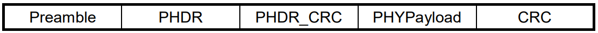
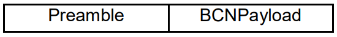

# Cheat Sheet

https://lora.readthedocs.io/en/latest

# Physical Layer Packet Format

LoRa uses two types of packet formats for data transmission: explicit and implicit.

In **explicit** mode, a LoRa packet includes the following elements:

* **Preamble** is used to synchronize the receiver with the transmitter. It MUST consist of 8 symbols for all regions as mentioned in the LoRaWAN Regional Parameters document. However, the radio transmitter will add another 4.25 symbols resulting in a final preamble length of 8 + 4.25 = 12.25 symbols.

* **PHDR (Physical Header)** is an optional element only present in the explicit mode that contains information about payload size and CRC (Cyclic Redundancy Check).

* **PHDR_CRC (Header CRC)** is an optional field that contains an error detecting code for correcting errors in header.

The PHDR and PHDR_CRC are encoded with the Coding Rate of 4/8.

* **PHYPayload** contains the complete frame generated by the MAC layer. The maximum payload size varies by DR (Data Rate) and is region-specific.

* **CRC** is an optional field that contains an error detecting code for correcting errors in the payload of uplink messages.

The PHYPayload and CRC are encoded with one of the Coding Rates (4/5, 4/6, 4/7, or 4/8). The complete frame is then sent using one of the Spreading Factors (SF = 7 to 12).

The following figure shows the physical layer structure of uplink and downlink packets that uses explicit mode.

*Physical structure of an uplink packet*

*Physical structure of an downlink packet*

In **implicit** mode, the header is removed from the packet where the payload size and Coding Rate are fixed or known in advance.

Beacons use LoRa radio packet implicit mode for sending time synchronizing information from gateways to the end devices.

The following figure shows the structure of a LoRa packet that uses the implicit mode.

# Frequency Bands

<table>
<tbody><tr><!-- Row 1 -->
<th><b>Region</b></th><!-- Col 1 -->
<th><b>LoRa Frequency Band</b></th><!-- Col 2 -->
<th><b>LoRa Channel Frequency</b></th><!-- Col 3 -->
</tr>
<tr><!-- Row 2 -->
<td><b>Europe</b></td><!-- Col 1 -->
<td> 863 to 870 MHz</td><!-- Col 2 -->
<td>
868.10 Mhz (used by Gateway to listen )  
868.30 MHz (used by Gateway to listen ) 
868.50 MHz (used by Gateway to listen )  
864.10 MHz (used by End device to transmit Join Request) 
864.30 MHz (used by End device to transmit Join Request) 
864.50 MHz (used by End device to transmit Join Request) 
868.10 MHz (used by End device to transmit Join Request) 
868.30 MHz (used by End device to transmit Join Request) 
868.50 MHz (used by End device to transmit Join Request) 
</td><!-- Col 3 -->
</tr>
<tr><!-- Row 2 -->
<td><b>US (United States)</b></td><!-- Col 1 -->
<td> 902 to 928 MHz</td><!-- Col 2 -->
<td> 902.3 MHz to 914.9 MHz spaced at 200KHz (Upstream-64 channels)  
903 MHz to 914.2 MHz spaced at 1.6 MHz apart (Upstream- 8 channels)   
923.3 MHz to 927.5 MHz spaced at 600KHz apart (Downstream- 8 channels) </td><!-- Col 3 -->
</tr>
<tr><!-- Row 2 -->
<td><b>UK (United Kingdom)</b></td><!-- Col 1 -->
<td>863–870 MHz </td><!-- Col 2 -->
<td>Sub-Bands: 868 MHz band, same as Europe. </td><!-- Col 3 -->
</tr>
<tr><!-- Row 2 -->
<td><b>Australia</b> </td><!-- Col 1 -->
<td>915–928 MHz </td><!-- Col 2 -->
<td>Sub-Bands: Typically uses 915 MHz with similar rules to the US. </td><!-- Col 3 -->
</tr>
<tr><!-- Row 2 -->
<td><b>Philippines</b> </td><!-- Col 1 -->
<td> 920–925 MHz </td><!-- Col 2 -->
<td> Sub-Bands: Specific to the 920 MHz segment.</td><!-- Col 3 -->
</tr>
<tr><!-- Row 2 -->
<td><b>China</b></td><!-- Col 1 -->
<td> 779 to 787 MHz, 470-510 MHz </td><!-- Col 2 -->
<td>  779.5 MHz (Default channel)  
779.7 MHz (Default channel)   
779.9 MHz (Default channel)   
779.5 MHz (Used by ED to transmit Join Request) 
779.7 MHz (Used by ED to transmit Join Request) 
779.9 MHz (Used by ED to transmit Join Request) 
780.5 MHz (Used by ED to transmit Join Request) 
780.7 MHz (Used by ED to transmit Join Request) 
780.9 MHz (Used by ED to transmit Join Request) 
</td><!-- Col 3 -->
</tr>
</tbody></table>