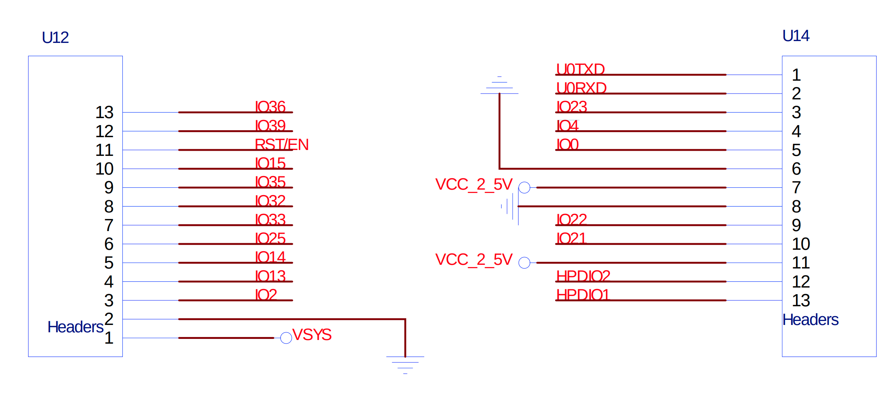

# IOT-902 Materials (Box 01)

## Sensor Board

name: T-Beam T22 V1.1 / T_BEAM_SX1276
store page: https://lilygo.cc/products/t-beam?variant=43059202719925
GH: https://github.com/Xinyuan-LilyGO/LilyGo-LoRa-Series

LoRa Pins:
* SPI SCK: 5
* SPI MISO: 19
* SPI MOSI: 27
* LoRa SS: 18
* LoRa RST: 23
* LoRa DIO0: 26

## Gateway Board

name: Lora 32 / HTIT-WB32LA_V3 (LoRa Node Dev Kit)
datasheet: https://resource.heltec.cn/download/WiFi_LoRa_32_V3/HTIT-WB32LA_V3(Rev1.1).pdf
GH: https://github.com/Heltec-Aaron-Lee/WiFi_Kit_series
processor: ESP32-S3FN8
OLED display: SSD1306 (https://crates.io/crates/ssd1306)
LoRa module: SX1276
C LoRa library: https://github.com/HelTecAutomation/ESP32_LoRaWAN

## Battery

name: Rechargeable Li-ion Battery 3000mAh, 3.7V

## Dust Sensor

name: Waveshare Dust Sensor
wiki: https://www.waveshare.com/wiki/Dust_Sensor

## Microphone
name: InvenSense INMP441
datasheet: https://octopart.com/datasheet/inmp441-invensense-86726512
tutorial: https://dronebotworkshop.com/esp32-i2s/

## Pressure Sensor

name: GY-BMP280
config key: `CFG_KEY_BMX280_READ`
method: `cfg::bmx280_read`

## DNMS (Intermediary board to connect to the microphone)

firmware: https://github.com/hbitter/DNMS/blob/master/Firmware/Teensy/Teensy4.0/V4/DNMS_V4.4.4/DNMS_V4.4.4.ino

## Other

- long breadboard (power rails are full-length)
- 40x male-male cables
- 40x female-female cables
- 40x male-female cables

## Rust Libraries

LoRa / Radio HAL:
- (**check this one first**) https://github.com/lora-rs/lora-rs
- https://github.com/rust-iot/radio-hal
- https://github.com/matheo-lucak/rust-radio-sx127x (fork by former MSc-2 student)

Dust Sensor:
We'll have to write our own driver for this one.
Prior Art: https://github.com/melodyasper/embedded-rust-gp2y1014au (it's out of date)
https://github.com/bugadani/esp32s3-defmt-example

