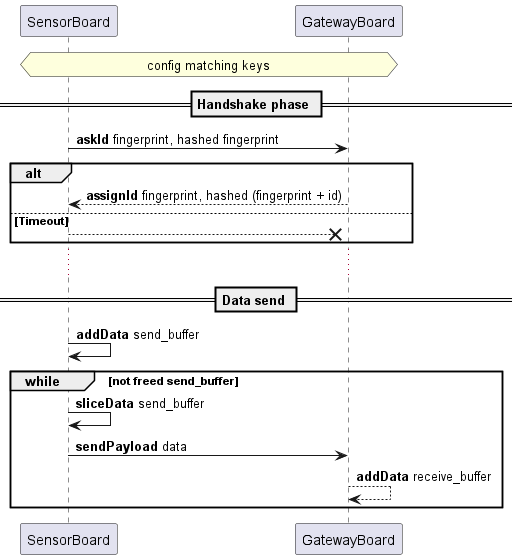

# Unnamed Protocol Stack v1.0

# 1 Introduction

## 1.1 Purpose

This file describes the Unnamed Protocol Stack, a full-stack protocol for exchanging messages between a gateway and one
or
more clients over LoRa. The protocol is designed to be simple to implement and energy efficient for clients.

## 1.2 Overview

The protocol stack consists of three layers:

- **Physical Layer**: The physical layer is responsible for the transmission and reception of raw bit streams over a
  physical medium. In this case, it uses LoRa radio technology.
- **Link Layer**: The link layer is responsible for establishing and maintaining a reliable communication link between
  the client and the gateway. It handles error detection and correction, as well as flow control.
- **Application Layer**: The application layer is responsible for the actual data exchange between the client and the
  gateway. It defines the format of the messages exchanged, including the types of data that can be sent and received.

## 1.3 Requirements

The keywords "MUST", "MUST NOT", "REQUIRED", "SHALL", "SHALL NOT", "SHOULD", "SHOULD NOT", "RECOMMENDED", "MAY",
and "OPTIONAL" in this document are to be interpreted as described in RFC 2119.

## 1.4 Terminology

- **Client**: A device that sends and receives data to/from the gateway.
- **Gateway**: The central device that communicates with clients.
- **Uplink**: Data sent from the client to the gateway.
- **Downlink**: Data sent from the gateway to the client.

# 2 Physical Layer

Here are the recommended LoRa parameters for the Unnamed Protocol Stack:

| Parameter        | Value     |
| ---------------- | --------- |
| Frequency        | 868.2 MHz |
| Bandwidth        | 250 kHz   |
| Coding Rate      | 4/8       |
| Spreading Factor | 10        |

# 3 Link Layer Protocol

## 3.1 Timing

The protocol is divided into two phases with an initial configuration phase:

- **Configuration Phase**: Both client and gateway has to be given matching pair of key to sign the exchange
- **Handshake Phase**: The client initiates the connection by asking an ID to the gateway. It has to send a fingerprint and hash it to ensure integrity.
  The gateway responds with an ID and the same fingerprint and hash it with the ID.
- **Data send**: After a successful handshake, the client can send data to the gateway and then receive data from the gateway.

## 3.2 Packet Types & Format

The link layer uses the modulation scheme of LoRa to implement a master/slave communication between boards.
A packet can be :

- **Uplink**: Sensor board to gateway 
- **Downlink**: Gateway to sensor board

Every packet follows this pattern

- The two first bits represent the action. 
  - First bit is used to switch between handshake phase or data send.
  - Second bit is reserved for future use.
- The next four bits are used to identify the sensor board. This ID is given by the gateway.
- The next thirty four bits are used to sign the payload and ensure authenticity of the data. The signature MUST be a SHA-256 hash (truncated from MSB).

### 3.2.1 Handshake Phase

The sensor board MUST initiate the request of an ID by sending a packet as follows:

- action bits: 10
- ID: 0000
- signature: signature of the fingerprint
- payload: a fingerprint (SHOULD be a MAC address)

If the gateway doesn't have any ID slot left, it gives the last assigned ID. It sends a packet as follow:

- action bits: 10
- ID: the new sensor board ID
- signature: signature of (fingerprint + ID)
- payload: the same fingerprint sent by the sensorboard

### 3.2.2 Data Send

Once handshake is done, both boards can send a packet as follow:

- action bits: 00
- ID: the sensor board ID
- signature: signature of the payload
- payload: data to send

# 4 Application Layer Protocol

## 4.1 Timing

The communication is divided into two phases:

- **Handshake Phase**: The client initiates the connection by sending a HandshakeStart packet to the gateway. The
  gateway responds with a HandshakeEnd packet, which includes the protocol version and a reference timestamp.
- **Uplink Phase**: After a successful handshake, the client can send SensorData packets to the gateway. The gateway
  acknowledges the receipt of these packets with Ack packets, and can also send ResetConnection packets to the client.

## 4.2 Packet Types

| Name            | Id  | Responses    | Direction | Description                              |
| --------------- | --- | ------------ | --------- | ---------------------------------------- |
| HandshakeStart  | 0   | HandshakeEnd | uplink    | the first application-level packet.      |
| HandshakeEnd    | 1   | n/a          | downlink  | end of handshake                         |
| Ack             | 2   | n/a          | downlink  | neutral response                         |
| SensorData      | 3   | Ack          | uplink    | one or more typed values                 |
| ResetConnection | 4   | n/a          | downlink  | make a full reconnect attempt on receive |

### 4.2.1 HandshakeStart

The client sends a HandshakeStart packet to the gateway to initiate the handshake process.  
This packet includes the major and minor version of the protocol that the client supports.

### 4.2.2 HandshakeEnd

In response to the HandshakeStart packet, the gateway sends a HandshakeEnd packet back to the client.

This packet includes the major and minor version of the protocol that the gateway supports and a reference timestamp
(called _epoch_) in milliseconds since system boot of the gateway.

The response version must satisfy the following conditions:

- the major version MUST be the same as the client.
- the minor version MUST be the same or lower than the client.

The gateway is allowed to NOT respond to the HandshakeStart packet if it does not support the protocol version,
or if it deems the connection attempt unacceptable.
In this case, the client MAY retry the handshake process after a random delay.

### 4.2.3 Ack

The Ack packet is a neutral response from the gateway to the client.
It does not contain any data and is used to acknowledge the receipt of an uplink request.

### 4.2.4 SensorData

After a successful handshake, the client MAY send SensorData packets to the gateway.
The SensorData packet contains one or more typed values, each with a time offset in seconds from the handshake epoch.
The time offset is rounded up to the nearest second.

### 4.2.5 ResetConnection

The ResetConnection is a downlink packet that forces the client to reset its connection to the gateway upon reception.
A full reconnect attempt is made at the link layer after the packet is received.

## 4.3 Packet Format

### 4.3.1 General Notes

- All packets are prefixed with a single byte indicating the packet type.
- The fields in each packet are contiguous and packed, there is no padding unless otherwise specified.
- Number ranges, denoted as `min:max`, are inclusive.

### 4.3.2 Basic Types

- `u8`: single byte, unsigned
- `uXX`: integer encoded using the [LEB128 variable-length](https://en.wikipedia.org/wiki/LEB128) encoding, in unsigned
  format
- `iXX`: integer encoded using the [LEB128 variable-length](https://en.wikipedia.org/wiki/LEB128) encoding, in signed
  format
- `f32`: 32-bit floating point number, IEEE 754 format
- `T[N]`: array of `T` of size `N`

### 4.3.3 HandshakeStart

| Name     | Size         | Type           | Value | Description                   |
| -------- | ------------ | -------------- | ----- | ----------------------------- |
| type     | 1            | u8             | 0     | Packet type (HandshakeStart)  |
| major    | 1            | u8             | 1     | Major protocol version (v1.0) |
| minor    | 1            | u8             | 0     | Minor protocol version (v1.0) |
| tail_len | 1:5          | u32            | --    | Length of `tail` array        |
| tail     | `0:tail_len` | `u8[tail_len]` | --    | unused as of version 1.0      |

For forward compatibility with future versions, decoders *should* read exactly `tail_len` bytes after the `tail_len` field itself,
even if the incoming data is overflowing the bounds of the expected values.

### 4.3.4 HandshakeEnd

| Name     | Size | Type | Value | Description                              |
| -------- | ---- | ---- | ----- | ---------------------------------------- |
| type     | 1    | u8   | 1     | packet type (HandshakeEnd)               |
| major    | 1    | u8   | 1     | major protocol version (v1.0)            |
| minor    | 1    | u8   | 0     | minor protocol version (v1.0)            |
| tail_len | 1:5  | u32  | 1:10  | length of `tail` array                   |
| epoch    | 1:10 | u64  | --    | reference unix timestamp in milliseconds |

For forward compatibility with future versions, decoders *should* read exactly `tail_len` bytes after the `tail_len` field itself,
even if the incoming data is overflowing the bounds of the expected values.

### 4.3.5 Ack

| Name | Size | Type | Value | Description       |
| ---- | ---- | ---- | ----- | ----------------- |
| type | 1    | u8   | 2     | packet type (Ack) |

### 4.3.6 SensorData

| Name   | Size | Type                 | Value | Description                  |
| ------ | ---- | -------------------- | ----- | ---------------------------- |
| type   | 1    | u8                   | 3     | packet type (SensorData)     |
| count  | 1    | u8                   | 1:255 | number of data points        |
| values | --   | `SensorValue[count]` | --    | data points, see table below |

**SensorValue**

| Name        | Size          | Type            | Value | Description                                                |
| ----------- | ------------- | --------------- |:-----:| ---------------------------------------------------------- |
| time_offset | 1:10          | i64             | --    | time offset from epoch in seconds                          |
| type        | 1:5           | u32             | --    | type of value, see **SensorValue Types** table             |
| value_len   | 1:5           | u32             | --    | length of `value` array                                    |
| value       | 0:`value_len` | `u8[value_len]` | --    | encoding of value according to **SensorValue Types** table |

**SensorValue Types**

| Name        | Type | Value Encoding | Description                             |
| ----------- | ---- | -------------- | --------------------------------------- |
| temperature | 0    | f32            | temperature in degrees Celsius          |
| pressure    | 1    | u32            | pressure in pascals                     |
| altitude    | 2    | f32            | altitude in meters                      |
| air_quality | 3    | f32            | air quality in mg/m3                    |
| unknown     | x    | n/a            | for compatibility with future protocols |

### 4.3.7 ResetConnection

| Name | Size | Type | Value | Description                   |
| ---- | ---- | ---- | ----- | ----------------------------- |
| type | 1    | u8   | 4     | packet type (ResetConnection) |
